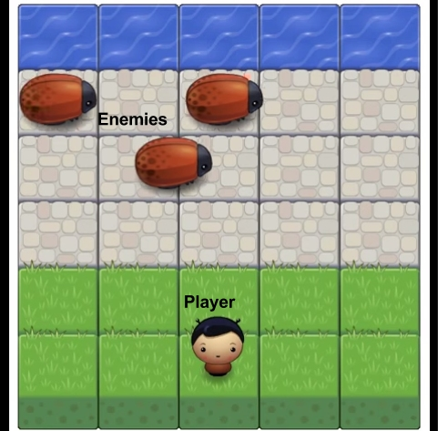

<h3>Final project for Object-Oriented Javascript Course on Udacity.</h3>

<b>Instructions to run:</b> 
After downloading, open the command prompt/terminal and change the directory to the root folder of this repository (i.e., the folder containing index.html). Then create a simple HTTP server by running <i><b>python -m SimpleHTTPServer</b></i>. Then open your browser and go to <i>localhost:8000</i>.

Course link: https://www.udacity.com/course/object-oriented-javascript--ud015
 
Project instructions: https://docs.google.com/document/d/1v01aScPjSWCCWQLIpFqvg3-vXLH2e8_SZQKC8jNO0Dc

